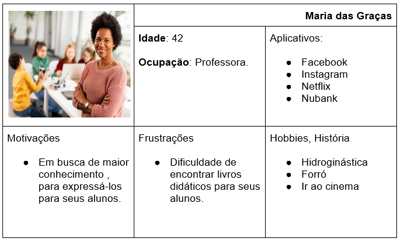
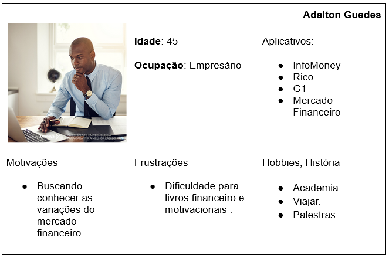
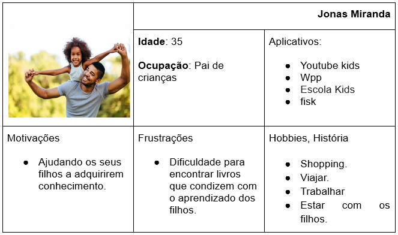
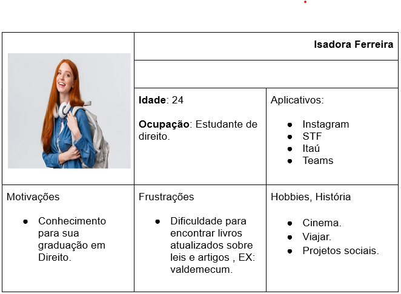
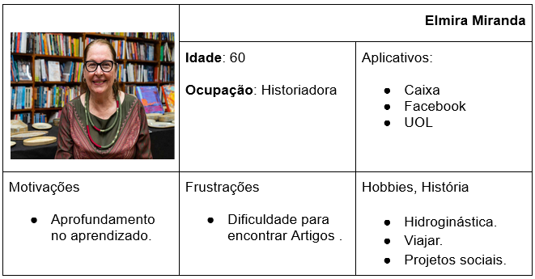
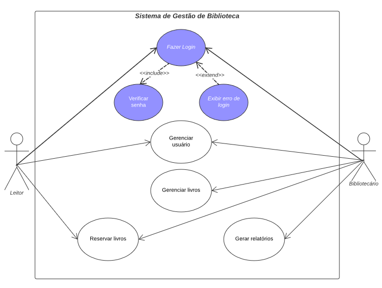

# Especificações do Projeto

Pré-requisitos: <a href="1-Documentação de Contexto.md"> Documentação de Contexto</a>

A definição exata do problema e os pontos mais relevantes a serem tratados neste projeto foi consolidada com a participação de possíveis usuários em um trabalho de consulta feito pelos membros da equipe. Os detalhes levantados nesse processo foram consolidados na forma de personas e histórias de usuários.

## Personas

As personas levantadas durante o processo de entendimento do problema são apresentadas na Figuras que se seguem.

## Histórias de Usuários

Com base na análise das personas forma identificadas as seguintes histórias de usuários:

|EU COMO... | QUERO/PRECISO ...  |PARA ...                 |
|--------------------|------------------------------------|----------------------------------------|
| Maria das Graças | fazer consultas rápidas através de palavras-chave | ter mais agilidade na busca de conteúdos de forma simples e ter uma lista de livros associados |
| Maria das Graças | verificar as disponibilidades | fazer pesquisa de obras literárias |
| Adalton Guedes | poder realizar uma procura por uma barra de pesquisa eficiente | conseguir achar os temas com facilidade |
| Adalton Guedes | visualizar o conteúdo dos livros | oferecer a possibilidade de ler trechos iniciais dos livros |
| Jonas Miranda | ter fácil acesso aos livros | fazer uma aplicação simples e intuitiva |
| Jonas Miranda | fazer renovação de empréstimos | ter um aplicativo intuitivo de fácil uso. |
| Isadora Ferreira | maior disponibilidade de livros | aumentar meu interesse pela leitura |
| Isadora Ferreira | de facilidade de empréstimo | efetuar reservas online |
| Elmira Miranda | de diversidade de livros | aprimorar minhas pesquisas |
| Elmira Miranda | fazer contato com a biblioteca | ter um canal direto com a biblioteca |

## Requisitos

O escopo funcional do projeto é definido por meio dos requisitos funcionais que descrevem as possibilidades interação dos usuários, bem como os requisitos não funcionais que descrevem os aspectos que o sistema deverá apresentar de maneira geral. Estes requisitos são apresentados a seguir.

### Requisitos Funcionais

A tabela a seguir apresenta os requisitos do projeto, identificando a prioridade em que os mesmos devem ser entregues.

|ID    | Descrição do Requisito  | Prioridade |
|------|-----------------------------------------|----|
|RF – 01 |	O sistema deve permitir novos usuários se cadastrarem e efetuarem login para acessar suas funcionalidades. | ALTA |
|RF – 02 |	O sistema deve permitir que um usuário edite suas próprias informações de usuário. | BAIXA |
|RF – 03 |	O sistema deve permitir que o usuário apague sua conta. | BAIXA |
|RF – 04 |	O sistema deve apresentar uma lista com todos os livros disponíveis na biblioteca. | ALTA |
|RF – 05 |	O sistema deve permitir que qualquer usuário visualize todas as informações de um livro selecionado na lista. | ALTA |
|RF – 06 |	O sistema deve permitir que um usuário reserve um livro que não esteja reservado ainda. | MÉDIA |
|RF – 07 |	O sistema deve permitir que usuários cadastrem novos livros. | ALTA |
|RF – 08 |	O sistema deve permitir que um usuário do tipo bibliotecário atualize informações dos livros.  | MÉDIA |
|RF – 09 |	O sistema deve permitir que um usuário do tipo bibliotecário apague livros do sistema. | BAIXA |
|RF – 10 |	O sistema deve gerar para o bibliotecário um relatório dos livros mais reservados. | MÉDIA |
|RF – 11 |	O sistema deve gerar para o bibliotecário um relatório dos usuários que mais reservaram livros. | MÉDIA |

### Requisitos não Funcionais

A tabela a seguir apresenta os requisitos não funcionais que o projeto deverá atender.

|ID     | Descrição do Requisito  |Prioridade |
|-------|-------------------------|----|
|RNF - 01 |	O site deve ser compatível com os principais navegadores do mercado. (Microsoft Edge, Google Chrome, Mozilla Firefox) | ALTA |
|RNF - 02 | O sistema deve ser responsivo. | MÉDIA |
|RNF - 03 | O sistema deve estar disponível 99% das 24 horas diárias. | ALTA |
|RNF - 04 | O sistema deve estar alinhado com as normas de privacidade do cliente. | ALTA |
|RNF - 05 | O sistema deverá informar ao usuário quando a mesma estiver em manutenção e/ou fora do ar. | MÉDIA |
|RNF - 06 | O sistema deverá ter uma fácil usabilidade para o usuário. | MÉDIA |

## Restrições

As questões que limitam a execução desse projeto e que se configuram como obrigações claras para o desenvolvimento do projeto em questão são apresentadas na tabela a seguir.

|ID| Restrição                                             |
|--|-------------------------------------------------------|
|RE - 01 | A solução deverá ser entregue ao fim do semestre letivo, não podendo extrapolar a data de 04/12/2023. |
|RE - 02 | A equipe não poderá subcontratar o desenvolvimento do sistema. |
|RE - 03 | A equipe não contará com aporte financeiro para desenvolvimento da aplicação. |
|RE - 04 |	A equipe de desenvolvimento se limitará a seis pessoas. |
|RE - 05 | O sistema deverá ser interativo. |
|RE - 06 | A aplicação deve ser desenvolvida com tecnologias do Backend |
|RE - 07 | A aplicação deve atender a LGPD. |

## Diagrama de casos de uso

