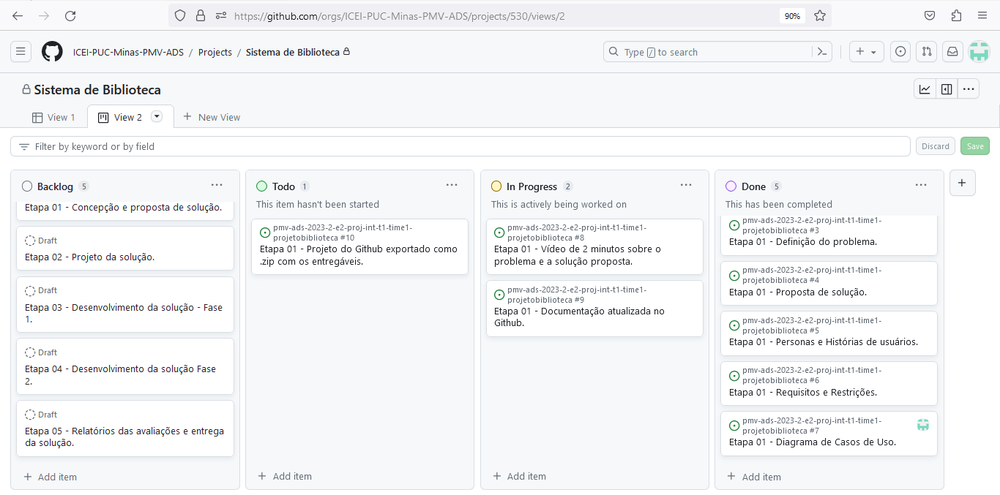

# Metodologia

## Controle de Versão

A ferramenta de controle de versão adotada no projeto foi o
[Git](https://git-scm.com/), sendo que o [Github](https://github.com)
foi utilizado para hospedagem do repositório.

O projeto segue a seguinte convenção para o nome de branches:

- `main`: versão estável já testada do software
- `unstable`: versão já testada do software, porém instável
- `testing`: versão em testes do software
- `dev`: versão de desenvolvimento do software

Quanto à gerência de issues, o projeto adota a seguinte convenção para
etiquetas:

- `documentation`: melhorias ou acréscimos à documentação
- `bug`: uma funcionalidade encontra-se com problemas
- `enhancement`: uma funcionalidade precisa ser melhorada
- `feature`: uma nova funcionalidade precisa ser introduzida

## Gerenciamento de Projeto

Devido à natureza do projeto, a metodologia de projetos adotada pela equipe é a ágil, sendo o Scrum o processo utilizado.

### Divisão de Papéis

A equipe está organizada da seguinte maneira: 

**Scrum Master:** 
Isaac Heder Ferreira Paulo

**Product Owner:** 
Ricardo Gomes Vieira

**Equipe de Desenvolvimento:**
João Victor Martins Pereira
Lucas Henrique Vasconcelos Siqueira

**Equipe de Design:** 
Ana Clara de Oliveira Ferreira
Gabriel Russo Grilo

### Processo

O gerenciamento do projeto, isto é, a organização e distribuição das tarefas, está em desenvolvimento com uso do Github e estruturado com as seguintes listas:

Backlog: Recebe as tarefas a serem trabalhadas, registra as atividades e representa o Product Backlog, isto é, as funcionalidades pretendidas que o produto tenha.  

Todo: É a relação das tarefas decididas no Sprint mais recente.  

In Progress: É a relação para onde são deslocadas as tarefas iniciadas.  

Done: Tarefas concluídas para entrega ao usuário após testes e controle de qualidade, sem mais revisões e prontas para uso.

## Backlog e Plano de Sprints

