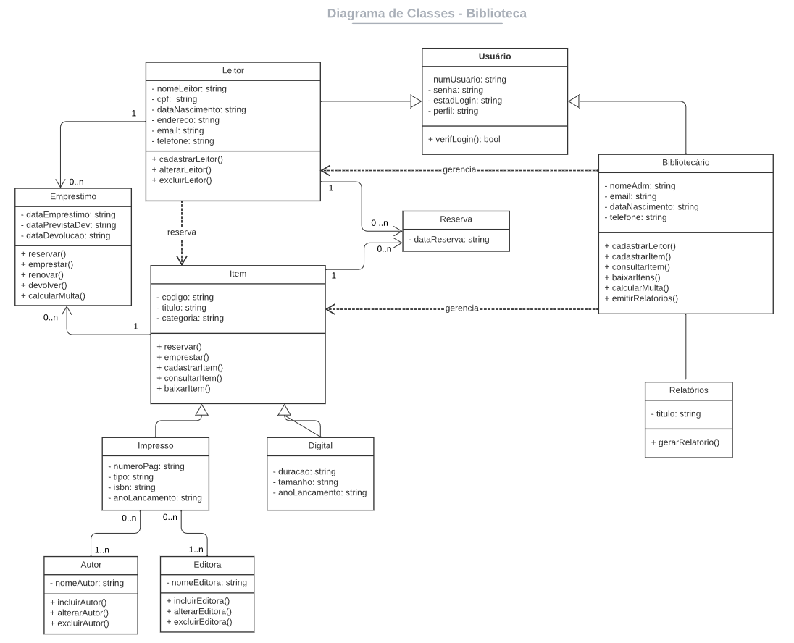

# Arquitetura da Solução

## Diagrama de Classes

O diagrama de classes a seguir ilustra como o software é estruturado. Para elaboração do diagrama foi utilizada a ferramenta Lucic Chart.

## Projeto de Banco de Dados

